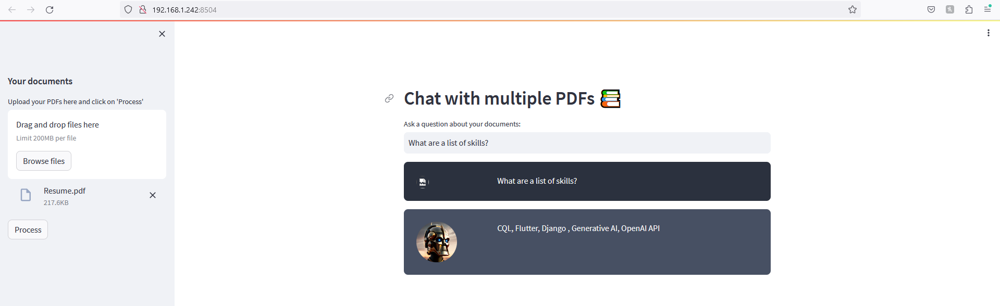

# Chat-with-Multiple-PDFs-LangChain-and-Python
Created a Langchain App to chat with multiple PDF files using the ChatGPT API and Huggingface Language Models. 

MultiPDF Chat App

    You can find the tutorial for this project on [YouTube](https://www.youtube.com/watch?v=dXxQ0LR-3Hg).

##Introduction

The MultiPDF Chat App is a Python application that allows you to chat with multiple PDF documents. You can ask questions about the PDFs using natural language, and the application will provide relevant responses based on the content of the documents. This app utilizes a language model to generate accurate answers to your queries. Please note that the app will only respond to questions related to the loaded PDFs.

##How It Works

##Results

##Notes

Remember to monitor your OpenAI API usage while testing because it will cause a ratelimiterror. You have to resolove this error by giving your card information to the OpenAI platform.
